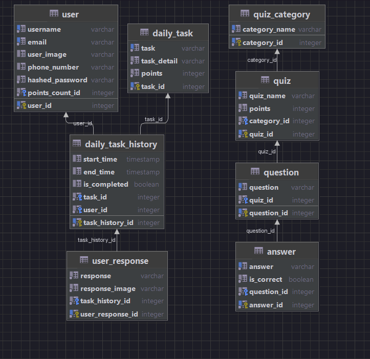

# EcoChallenge

The EcoChallenge app and website are innovative platforms designed to empower individuals and teams to make a positive impact on the environment. Engage in various environmental challenges, set goals, and track your progress as you embrace sustainable actions, conservation efforts, and personal behavior changes. Connect with a passionate community of like-minded individuals and organizations who share a common goal of creating a more sustainable future. With a wealth of resources, educational materials, and tools at your fingertips, the EcoChallenge app and website provide the support you need to make conscious choices and reduce your ecological footprint. Join the movement, be part of the solution, and let's create a greener world together.

## Technologies stack

- python
- fastapi
- sqlmodel
- pydantic
- asyncio
- postgres

## Database diagrams

